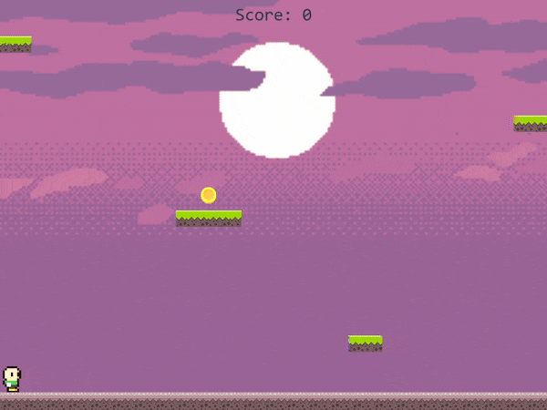

# Plat Jumper

Plat Jumper is an endless runner platform game where you try to reach as high as possible by jumping on the platforms. This game is developed with Python's [Pygame](https://www.pygame.org/) library.

## Demo of the Game

 

## Images Used in the Game

Grass Tiles: https://opengameart.org/content/platform-tiles-0  
Author: Alucard (https://opengameart.org/users/alucard)

Background:
Artwork created by Luis Zuno (@ansimuz)

Coin icons created by <a href="https://www.flaticon.com/free-icons/coin" title="coin icons">popo2021 - Flaticon</a>

Character: https://opengameart.org/content/classic-hero-and-baddies-pack  
Author: GrafxKid (https://opengameart.org/users/grafxkid)

Coin pickup sound:
https://opengameart.org/content/plingy-coin  
Author: Fupi (https://opengameart.org/users/fupi)
